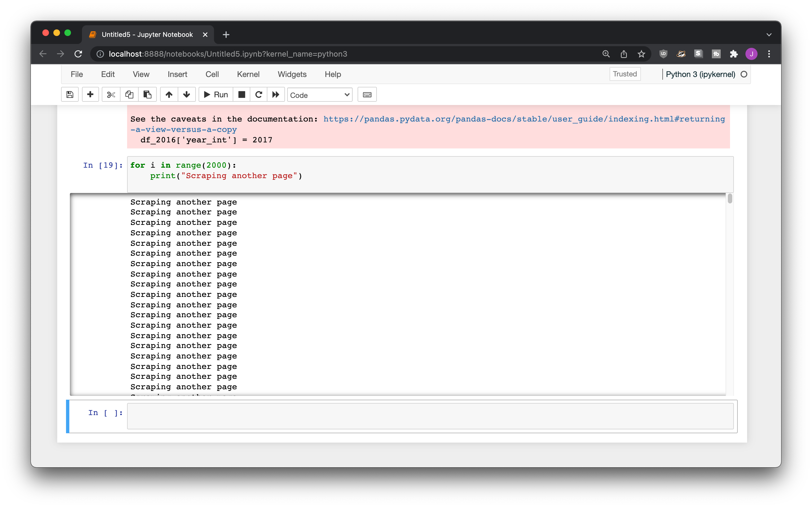
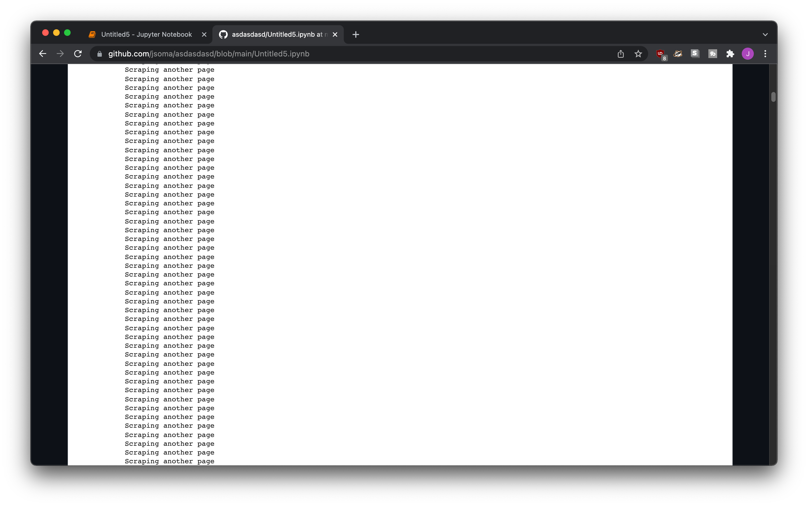
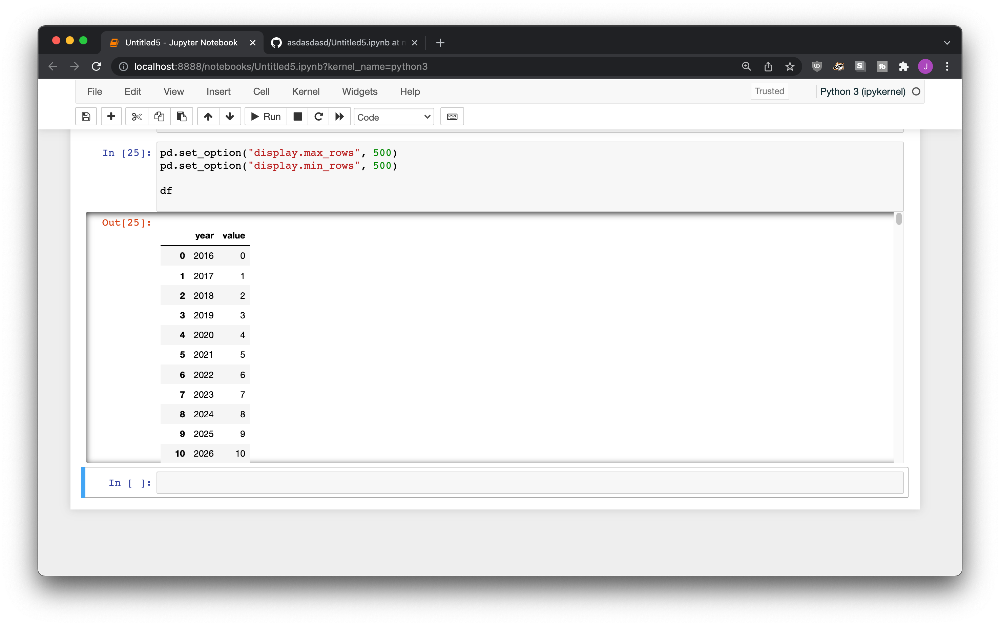
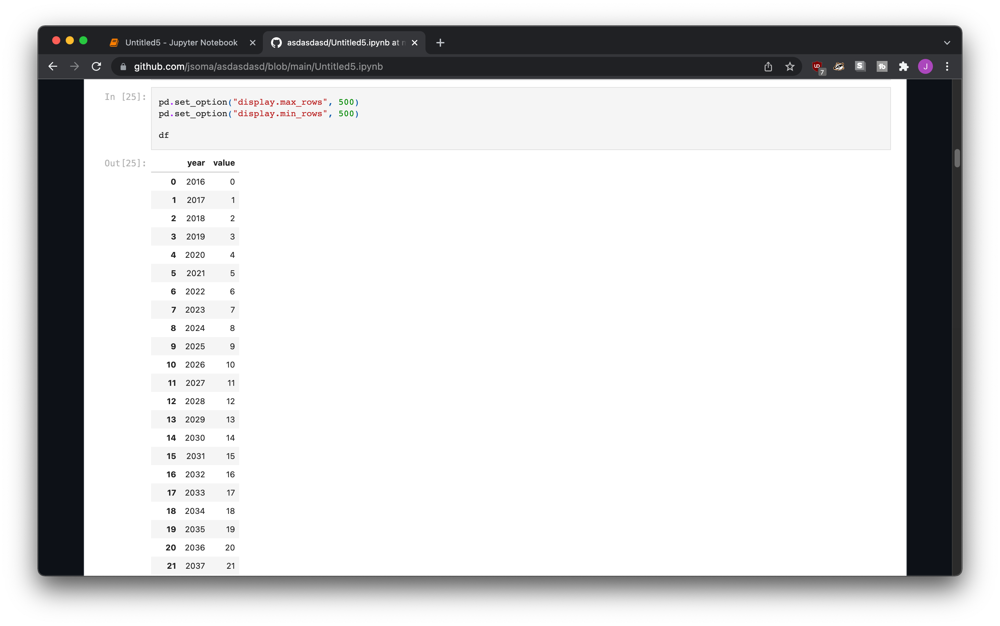
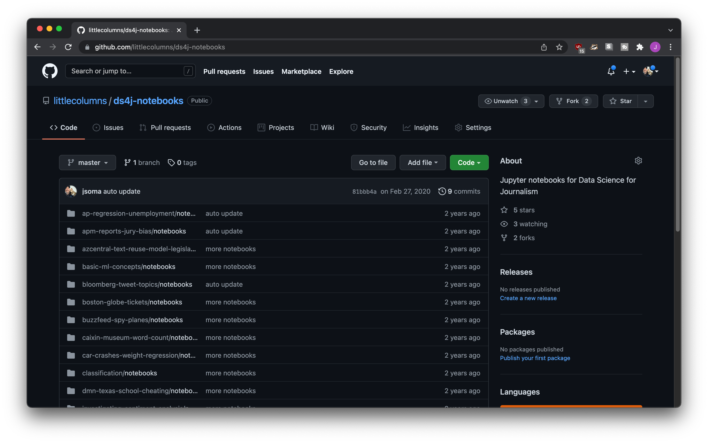
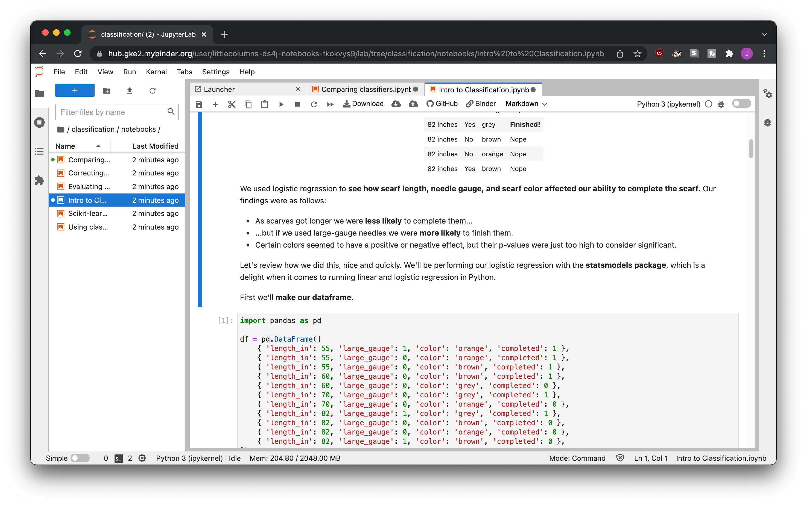

# Special considerations for Jupyter notebooks

Hosting [Jupyter Notebooks](https://jupyter.org/) in your GitHub repo allows people to follow along with your code and analysis in a friendlier, more approachable way than even a well-commented plain-text file. It does deserve some special considerations, however!

## Above all else: publish!

"I'm just going to clean the code up before posting it" are the words that are said before a notebook is never, ever uploaded. **Just upload it!**

Remember: No one wants to read your code, they only want to read _about_ your code. No one's going to look too closely, no need to be embarrassed!

## No errors

Jupyter notebooks are convenient in that they allow a back-and-forth discussion with your data and code, with each step you learn a little bit more about your data.

This sometimes means _missteps_, though, where you might do something that sends an error right back at you. Maybe you keep the broken code there for reference, or you just fix it in the next cell.

Before you publish, **clean up all those errors!** Even though no one is reading your code closely, errors take up a lot lot lot of space and are very obvious. If it's important that you keep the bad code, just comment it out.

As an extra bonus, not having any errors allows people to **run your code on their own machine.** If you ask Jupyter to run all of the cells in a notebook, it'll stop as soon as it encounters an error. Not a good user experience if you want to run from top to bottom! By getting rid of the bad code people are more easily able to reproduce what you were doing.

The best practice to make sure you're all set is to select **Restart and Run All** from the **Kernel** menu. This will clear all of the variables in your notebook and run it all from top to bottom. You'll quickly find out if there are any errors hiding in it!

## No long long outputs

### Too many `print` statements

Maybe you're scraping 2000 pages, and you don't know about [tqdm](https://tqdm.github.io/), so to keep track of what's going on you do a `print("Scraping another page")` every time you scrape a new page.

When it's on your computer it's no big deal, GitHub doesn't add a scrollbar to long output, so it'll end up being unattractively long.

If you don't want to run your cell again without the `print` in it, you can clear the cell contents instead. When you have your notebook running, follow these steps:

1. Click the cell in Jupyter
2. Select **Cell** from the top menu
3. **Current Output > Clear**

### Extra-long dataframes

If you're interested in seeing a lot of your data, you might use something like `pd.set_option("display.max_rows", None)` or `pd.set_option("display.min_rows", 500)` to view a lot of it at a time. It looks fine on your own machine, because Jupyter automatically sets you up with a nice scroll bar.

When you upload it onto GitHub, though, it gets displayed all at once. It's not a great experience for someone trying to read your code!

The easiest way to fix this is to go back into your notebook and change your options to not display so many rows. Since you already did your analysis you don't need to see anything else, right? Otherwise, you can clear the cell contents so that nothing shows up:

1. Click the cell in Jupyter
2. Select **Cell** from the top menu
3. **Current Output > Clear**

## Notebooks in the cloud

*This is only if you're really want to go the extra mile. Most of the people who do what I explain below are publishing papers on machine learning!*

An extra step in reproducibility is allowing people to run your notebooks with the click of a button. Tools like [Binder](https://mybinder.org/) and [Google Colab](https://colab.research.google.com/) allows visitors to your repository to load up your notebooks in the cloud, without even downloading them!

There are a _lot_ more words that need to be written to show you how this is done, but for now I'll just show you an example from [my online book about machine learning in journalism](http://investigate.ai/). While I built it for Google Colab, I think it should work with Binder, too!

There's a repository of notebooks that lives over at [https://github.com/littlecolumns/ds4j-notebooks](https://github.com/littlecolumns/ds4j-notebooks).

If you go to [the Binder website](https://mybinder.org/) you can plug the URL in and it'll generate a nice cloud Jupyter environment for you to play around in!

To encourage people to give it a try, you can provide a one-click link to launch a Binder environment. For example, the [Data Science for Journalism link](http://investigate.ai/) would be [https://mybinder.org/v2/gh/littlecolumns/ds4j-notebooks/HEAD](https://mybinder.org/v2/gh/littlecolumns/ds4j-notebooks/HEAD).

If you want to get extra fancy, you can use [a binder badge](https://mybinder.readthedocs.io/en/latest/howto/badges.html)!