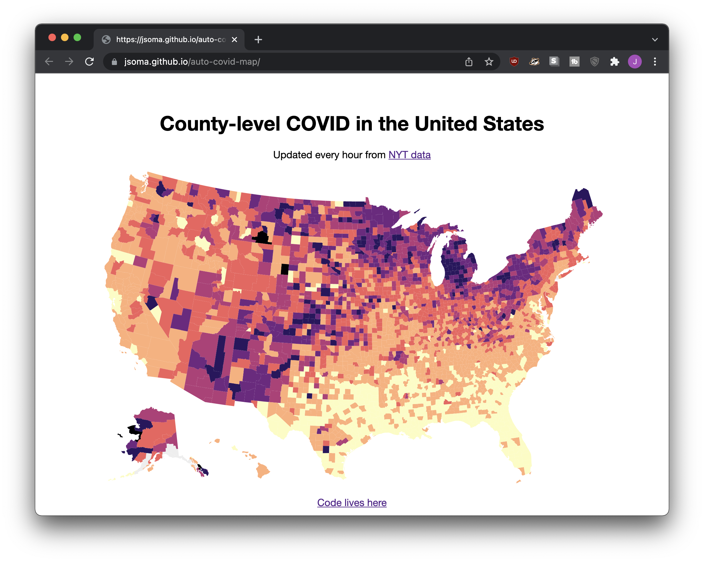

# Auto-updating pages with GitHub Actions

## Prep work

You need to know a tiny bit about two topics before heading into building auto-updating pages.

**GitHub Pages** is how you host websites on GitHub. Once you know how to create a website from a repo, it's a pretty quick jump to **automatically-updating web pages**! We covered building sites earlier (I'd add a link right here, but unfortunately the software I'm using to put this site together refuses to allow it).

**GitHub Actions** is a tool built into GitHub that you can use to automatically run tasks every so often. I recommend taking a look at the now-common technique of [using GitHub Actions to automatically scrape websites](https://simonwillison.net/2020/Oct/9/git-scraping/) to understand the basics.

## How to do it

Y'know, I spent a long long time putting something together, but *it just didn't turn out to be a good introduction*.

But if you'd like to check it out, keep reading! It's [this auto-updating COVID-19 map](https://jsoma.github.io/auto-covid-map/). The repo lives at [https://github.com/jsoma/auto-covid-map](https://github.com/jsoma/auto-covid-map).



It all boils down to **a web site that has an image on it**. The image updates, and as a result the website updates.

The website's code looks something like this:

```html
<h1>County-level COVID in the United States</h1>
<p>Updated every hour from <a href="https://github.com/nytimes/covid-19-data">NYT data</a></a></p>

```

The `` is the important part.

Every hour, a script is run that downloads some data from the New York Times, merges it with a shapefile from the Census Bureau, and generates a choropleth from the result. **This image is saved as `covid.svg`.**

Every time the script runs a new image is produced and committed to the repo. The commit makes GitHub Pages rebuild the site, and then the web page automatically gets updated with the new image.

GitHub Actions → something changes → new commit → page updates. **It's just that easy!**

If you're curious about the map-creating script itself, it's located in [`/.github/workflows/update_map.yml`](https://github.com/jsoma/auto-covid-map/blob/main/.github/workflows/update_map.yml). If you cut out all of the setup pieces the important pieces are:

```bash
wget -N  "https://raw.githubusercontent.com/nytimes/covid-19-data/master/rolling-averages/us-counties-recent.csv"
mapshaper cb_2020_us_county_500k.shp \
    -each 'JOIN_FIPS="USA-" + GEOID' \
    -join us-counties-recent.csv keys=JOIN_FIPS,geoid \
    -classify field=cases_avg_per_100k save-as=fill color-scheme=Magma invert \
        breaks=10,30,50,70,100,250 \
    -proj albersusa \
    -simplify 2% \
    -o covid.svg
```

All in all, any website that pulls a static file - whether it's a CSV, JSON, an image, whatever – can be automatically updated using this method! Just have GitHub Actions update that file and your site will be fresh and new with each change.
