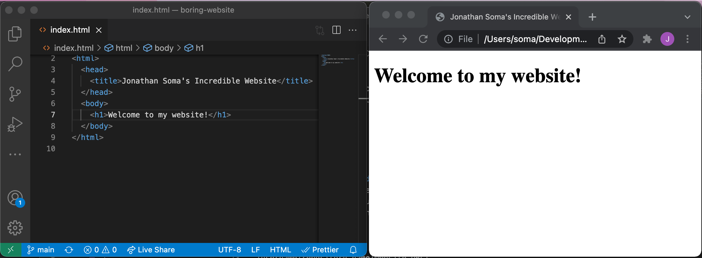
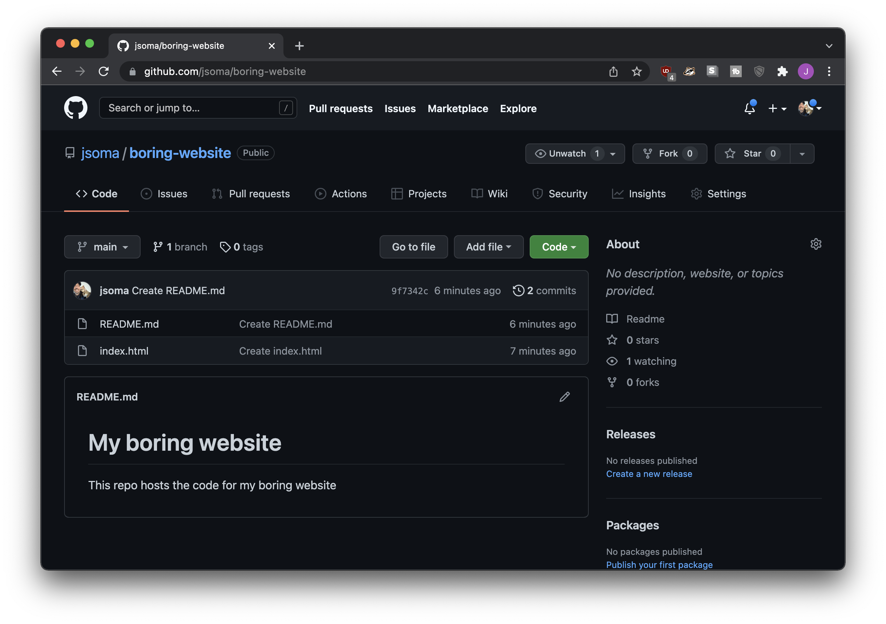
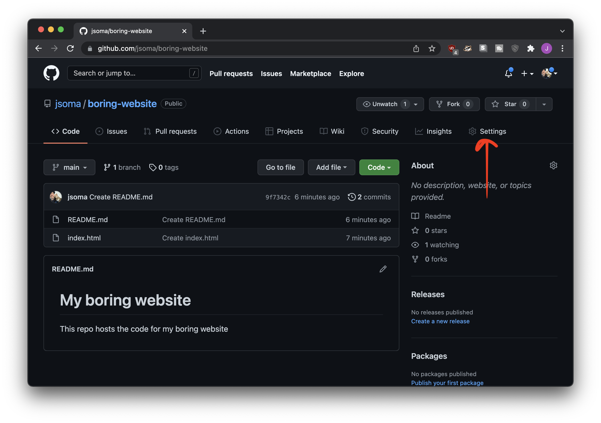
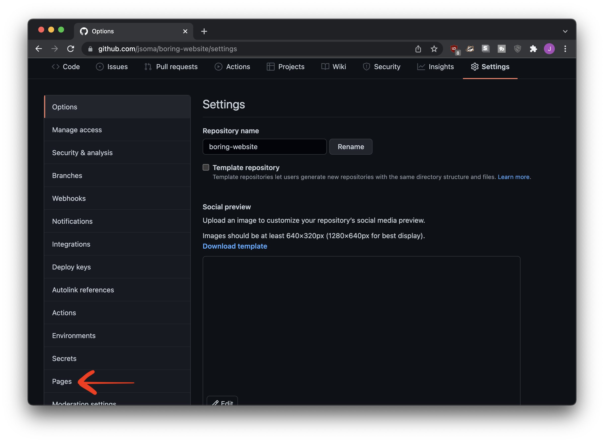
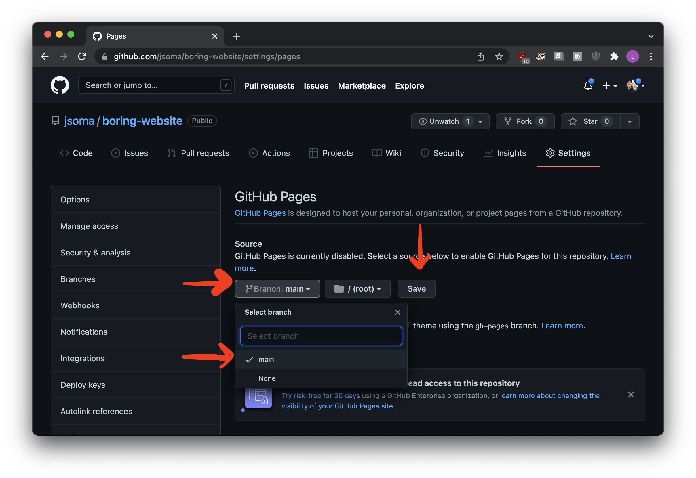
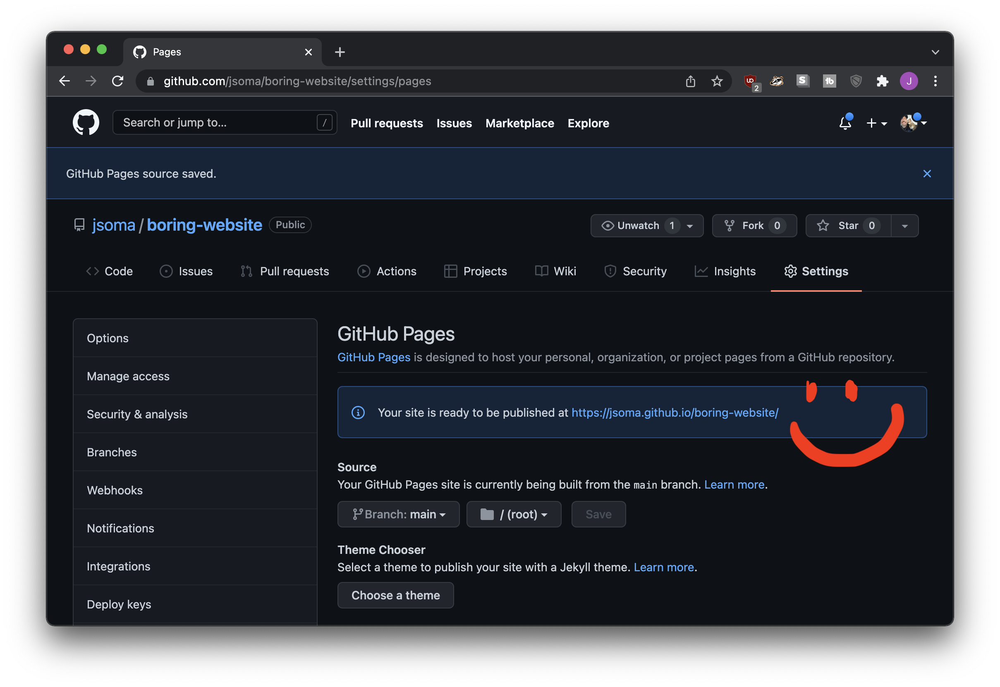
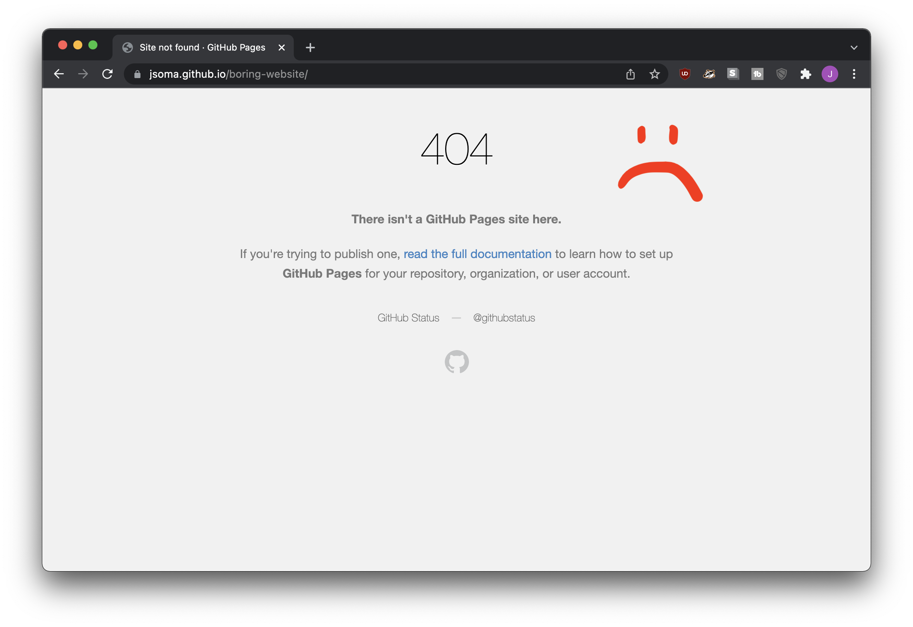
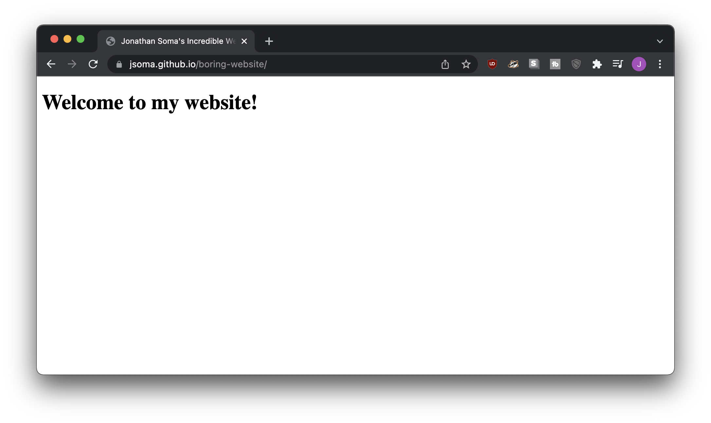
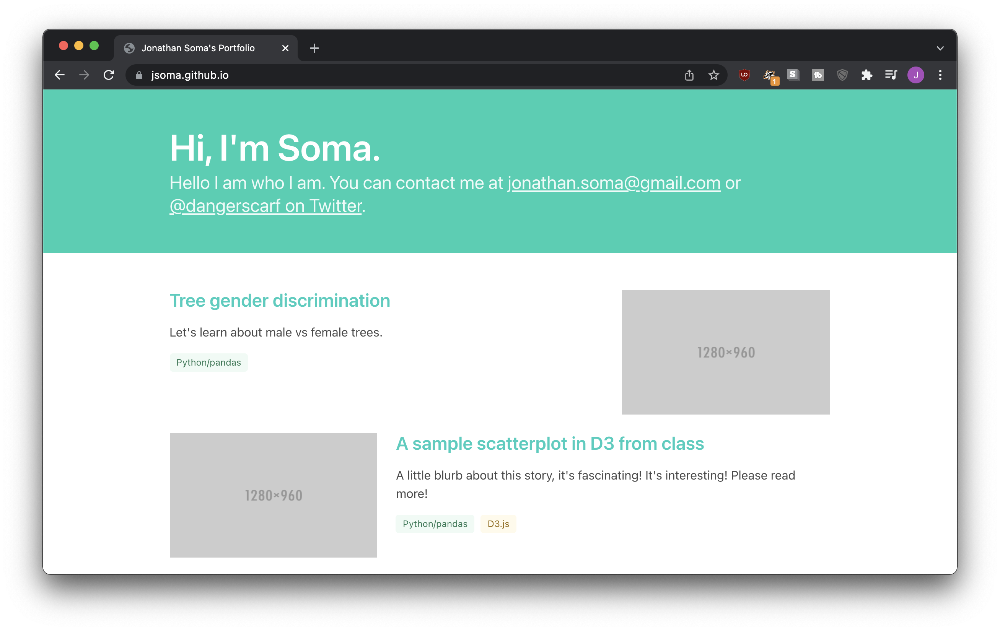

# Creating and hosting web pages on GitHub

If you want to host a website for free, GitHub's Pages feature is a pretty easy way to do it! You create a repository, click a couple buttons, and tada! You have a website.

## Building our website

### Our first HTML page

First, we need to create a web page that works on our own computer. We start off with some pretty simple code:

```html
<!doctype html>
<html>
  <head>
    <title>Jonathan Soma's Incredible Website</title>
  </head>
  <body>
    <h1>Welcome to my website!</h1>
  </body>
</html>
```

After we save it as `index.html`, it opens up nicely in our web browser.



Now we need to move it onto the internet!

### Creating a repository

After a little work, my file is now living in a repo called `boring-website` (I also added a `README.md` because I'm a completionist).



### Turning the repo into a website

1. Click **Settings** from the top menu
2. Click **Pages** from the left-hand menu
3. Select **main** (or **master**) from the dropdown, then click **Save**









It even gives us a nice clickable link that points to exactly where our website is! **But you'll be sad if you click it,** because it won't work yet. GitHub needs to work on things for a minute.



This is actually going to be a big big problem for you when you're working on your website.You'll make an update, nothing will change, and you'll ask yourself **did I really fix this** Did I forget to commit? Did my push not work?

But usually, no, you're fine, you're just waiting on GitHub. Give it a couple minutes and you'll have a delightful website.



## Making our website look nice

If we want to make our website look nice, we need to learn some **HTML and CSS**.

To learn the fundamentals, I recommend checking out my video series [Lazy basics of HTML, CSS, and JavaScript](https://www.youtube.com/watch?v=WO_it0hy0hg&list=PLewNEVDy7gq1vO4fTJe5fJw4u63qiKt0o) on YouTube. In about an hour it covers through the building blocks of the web.

Once we know the basics of how a web page is built, we can use those skills to fix our website up! Since we aren't fancy web designers, generally this involves using a **theme** or a **CSS framework**. Using a CSS framework to style your website is like buying clothes from a store instead of sewing them yourself: less flexibility but so, so, so much easier.

At the end of the Lazy Basics series I introduce you to a CSS Framework called **Bootstrap**, which will help you style your website look like every other tech website on the planet. I personally enjoy an alternative to Bootstrap called **Bulma**, which makes things look a _little_ more unique with a _little_ less effort.

You can find a tutorial with my buzzword-filled [Customize websites with the Bulma CSS framework: easy design tutorial with no CSS and no templates!](https://www.youtube.com/watch?v=iuLPLuxG2pI). In an hour we go from nothing to a pretty decent (and customizable!) portfolio template:



### Borrowing styles that you like

Of course, you don't have to go with a boring, blandly-designed template. Maybe you want to adapt someone else's design?

Luckily, I have a video for that, too: [Copy a website's style by stealing CSS!](https://www.youtube.com/watch?v=ggCyrzK7qNw), where we steal [Larry's style](https://larrybuch.com/).

## Choosing your URL

Now that we know how to build a website, let's talk about how GitHub Pages decides where it'll live.

First, the domain: if my GitHub username is `jsoma`, all of my GitHub Pages websites will live under the domain `jsoma.github.io`. That part is easy!

The rest of the URL depends on the **name of the repository**. Most of the time, the repository's name just gets added on after you domain. For example, a repo named **popcorn** can be turned into a website at `jsoma.github.io/popcorn`.

The one exception is if I want a site on `jsoma.github.io` with _nothing after it_. In that case, I make a repo called **jsoma.github.io**.

Let's look at some examples of what repositories might turn into:

|username|repository name|website URL|
|---|---|---|
|jsoma|website|https://jsoma.github.io/website|
|jsoma|bubblegum-candy|https://jsoma.github.io/bubblegum-candy|
|jsoma|jsoma.github.io|https://jsoma.github.io/|
|jsoma|mayonnaise.github.io|https://jsoma.github.io/mayonnaise.github.io|

Notice that last one! Because the username doesn't match the repository name, **it doesn't become `mayonnaise.github.io`**, the website just lives under `jsoma.github.io` as a weirdly-named directory.

### But also! Folders!

And one more thing: if I want a website at `jsoma.github.io/project-01`, I actually have _two options_.

1. Create a repo named **project-01**
2. Create a folder named **project-01** inside of my **jsoma.github.io** repository

Both of those will live at `jsoma.github.io/project-01`.

If you aren't sure whether you should put your project into its own repo or a folder, I recommend re-reading the [What gets a repository?](../organization/index.html#what-gets-a-repository) section.

## The `docs` folder trick

Sometimes you'll have a project that has all sorts of prep work before you get to the display portion. You'll be cranking through scrapers, notebooks, shapefiles, Excel and CSV files, etc etc etc, but in the end you'll also have a website.

How can you organize it all? It doesn't seem very well-structured to throw an `index.html` right next to your `Scraping.ipynb` and `final-analysis-export.csv`, does it?

Easy fix: **put all of your website code in a folder called `docs`.** When you tell GitHub to serve content as a website, one of the options you selected was that the files should come from "root," the very top of your repo.


If you put your web content into `docs` instead, you'll be able to select that folder from the dropdown. That way your HTML, CSS, and everything else can live a clean life hiding far away from the data analysis pieces.