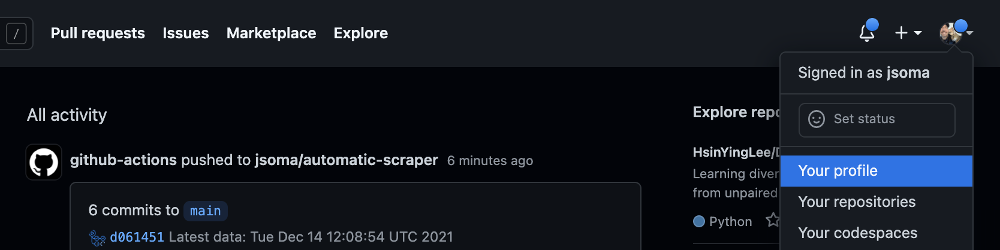
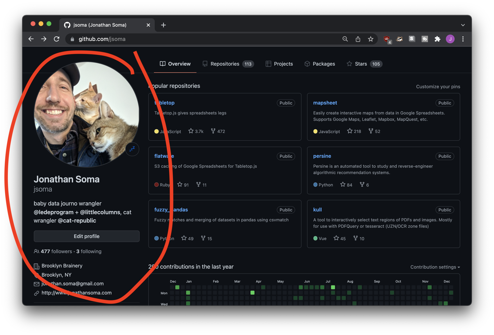
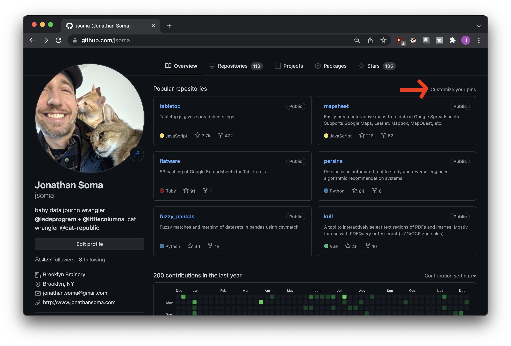
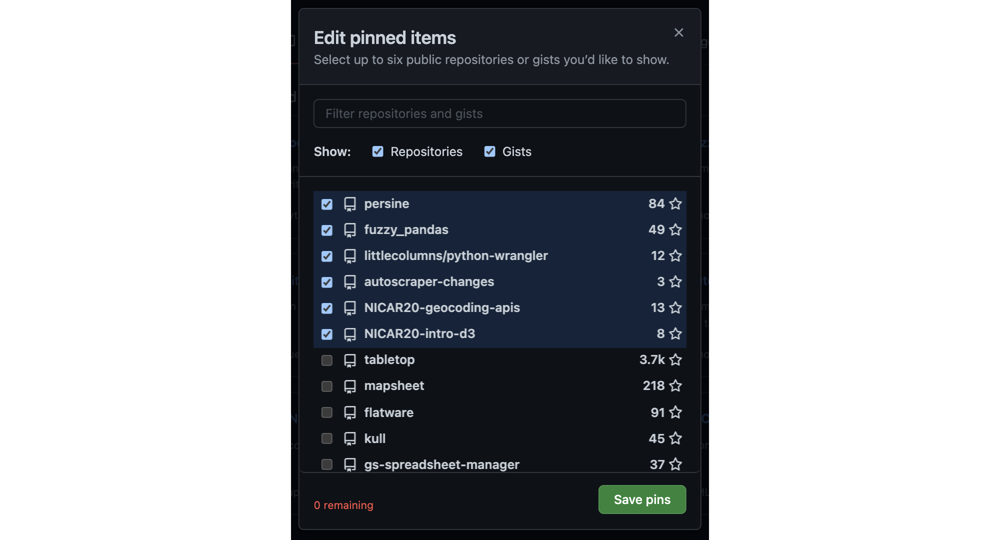
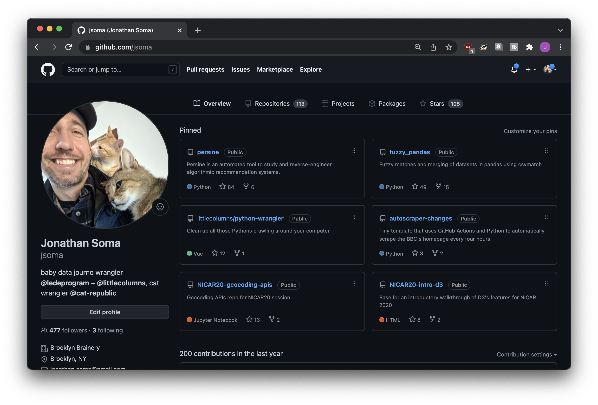
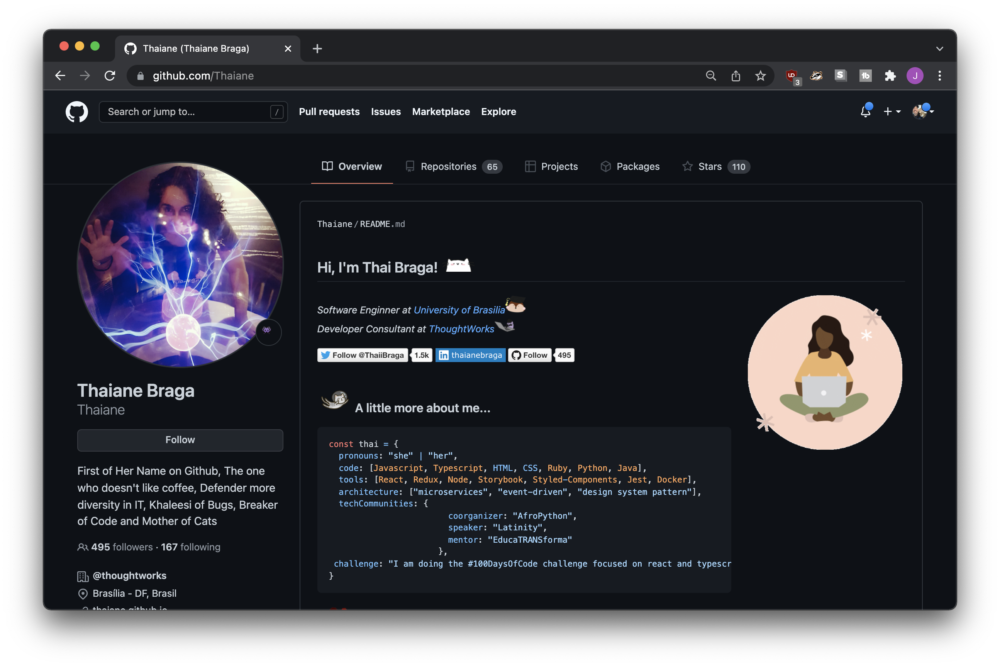

# Customizing your GitHub Profile

Although people won't spend too long gazing at your GitHub profile page, a little investment in fixing it up will go a long way!

To view your GitHub profile, click your account icon in the upper-right corner of the screen, then select **Your profile**.

[GitHub has a profile guide](https://docs.github.com/en/account-and-profile/setting-up-and-managing-your-github-profile) to step you through all sorts of topics, but we'll hit the big ones here.

## Updating your bio

Your GitHub profile contains who columns of information - the left hand side is about you as a person, and the right hand side is (generally, mostly) about your code. We'll start by updating your personal profile!

Click the **Edit profile** button and you'll be able to fill out all sorts of fields about yourself. You can also edit much of the same information at [https://github.com/settings/profile](https://github.com/settings/profile).

At the very least, you should add a name, upload a picture (if you feel comfortable), and write a short bio about who you are. A link to your homepage would be nice, but if you don't have one? No problem, we'll fix that up later!

## Selecting featured repositories

By default, your profile will list your **popular repositories** on the right-hand side.

If you don't like what GitHub has selected, click the **Customize your pins** link to the right of "Popular repositories." This will allow you to hand-select what repos are shown on your profile page.

You'll be presented with a list of your repositories and gists to display on your page. **Select up to six!**

*If you haven't used them yet, gists are like tiny baby repositories. You can create them at [gist.github.com](https://gist.github.com/)*

Figuring out which repositories to feature might be tough. Maybe you have one or two projects you're proud of, and then a number of scratch or homework repostiories that aren't so impressive. Your first instinct might be to select your two project repos, and then hide the homework away.

**Don't use this as an opportunity to hide all of your less exciting repositories!** Be sure to pick a full six repositories: the best repos first, then a few of the other, less exciting ones to fill up the space.

After you save, you'll be able to use the `⠠` button to position your favorites at the top. That way the one you're proud of will get all the attention, but you'll still have a nice full-looking profile!

*Note that you need to save your selections before you can order them.*

After you've picked the repositories you'd like to feature on your profile page, click **Save pins** and you'll be sent to view the finished product.

Beautiful!

## BONUS: A profile README

Back in 2020 GitHub released the ability to add [READMEs to your profile](https://docs.github.com/en/account-and-profile/setting-up-and-managing-your-github-profile/customizing-your-profile/managing-your-profile-readme).

This can get very crazy, very fast – pictures, links, tables, animated gifs, anything is possible! For example, check out [Thaiane Braga's GitHub profile](https://github.com/Thaiane):

Head on over to [Abhishek Naidu's Awesome GitHub Profile README list](https://github.com/abhisheknaiidu/awesome-github-profile-readme) for more inspiration.

If you feel like your personality and skills can't be contained in that tiny bio box, you can use [GitHub's guide](https://docs.github.com/en/account-and-profile/setting-up-and-managing-your-github-profile/customizing-your-profile/managing-your-profile-readme) to set up a custom README-based profile. The process isn't too tough, you'll just create a repo named after your username and place a `README.md` inside of it.