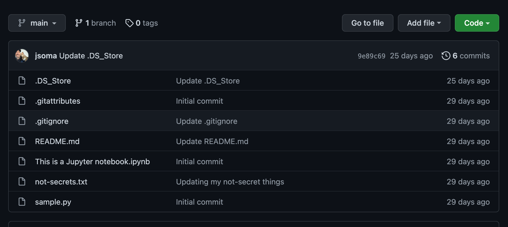
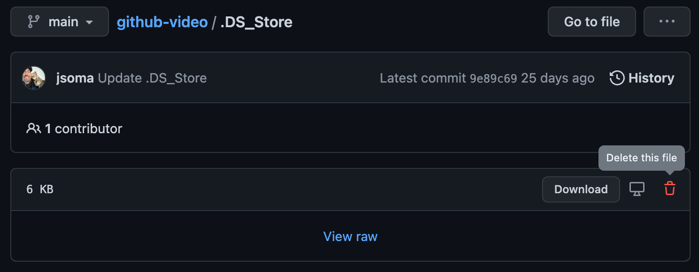
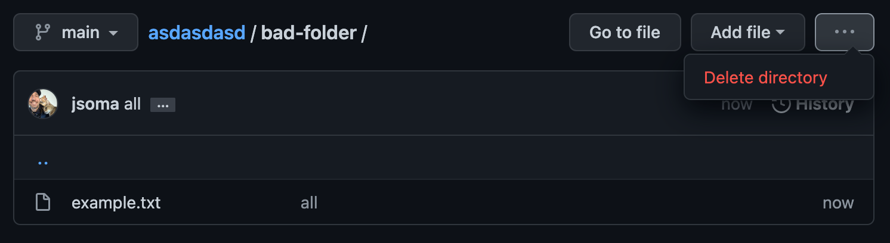

# Ignoring files with `.gitignore`

## What is a `.gitignore` file?

Sometimes either you or your computer create files you **don't want included in your repository.** Temporary files, temporary notes, API keys, all sorts of things that belong on your machine but not up on GitHub.

For keeping out clutter, your best friend is going to be what's called a `.gitignore` file. It's a file – yes, named `.gitignore` – that sits in your repo and tells git which files it shouldn't try to add into the repository.

## What belongs in `.gitignore`?

If you're been blessed to not have an awful, cluttered GitHub repo, maybe you aren't sure why we'd ignore files. Let's start with an example!

The poster child of GitHub clutter is an OS X file called `.DS_Store`. Macs have a nasty habit of adding it to every directory that you look at, despite the fact that _it doesn't really do anything._ It just sits there looking ugly at the top of your repo, like this:

You can see [over 500,000 examples of people removing `.DS_Store`](https://github.com/search?q=remove+.DS_Store&type=commits) with a simple GitHub search! Beyond `.DS_Store`, most of what you want to keep out is based on what kind of developer you are:

* `.ipynb_checkpoints`, if you use Jupyter Notebooks
* `.vscode` if you use Visual Studio Code
* `node_modules`, if you're a JS developer

And many, many, _many_ more.

## Creating a `.gitignore`

You can add files to ignore one-by-one, or you can just go find a list. I usually go to [gitignore.io](htpps://gitignore.io) to type in a mishmash of buzzwords about what I program in:

* OSX
* VisualStudioCode
* Python

And it gives me [a nice long `.gitignore`](https://www.toptal.com/developers/gitignore/api/osx,visualstudiocode,python) I can drop into my repo right from the start. If there are other files I need to add, I can add them on a case-by-case basis.

*If you're using GitHub Desktop, you can go to the **Repository > Repository Settings > Ignored Files** field.*

## Help! It's already in the repo!

If you have some files that are already in the repo that you'd like to ignore, just adding a `.gitignore` won't help you. You also need to remove the file from the existing repository! It's not too bad, though:

First, update your `.gitignore` to include the file

Then, we need to tell git to stop tracking the file:

* If you're using the **command-line version** of git, you can tell git to stop tracking a file with `git rm --cached filename`. Commit the change, push to GitHub, and you're all set!
* If you're using **GitHub Desktop**, the easiest way is to delete it from _the GitHub website_. It feels like cheating, but hey, it works! Click on the file or folder, then find the delete option. It will be in a slightly different location depending on whether it's a single file or a directory:

You can also do this if you're using the command line.

Refresh your repository, and bask in the joy of a nice clean page!

### Note: Errors when pushing new updates

If you did your deleting through the GitHub website, the next time you try to push up a new commit git will throw an error, then start yelling that you need to **"pull changes from remote"**. This just means take the updates from the web and save them to your computer's version of the repository.

On the command line this means typing `git pull` (or whatever command the error tells you to run), and for GitHub Desktop you just click whatever blue button it guides you to about four or five times.

## Files we shouldn't ignore

Now that we've covered files we want to get rid of, another important aspect is files we *do* want. Specifically, `README.md`, your repository's introduction!