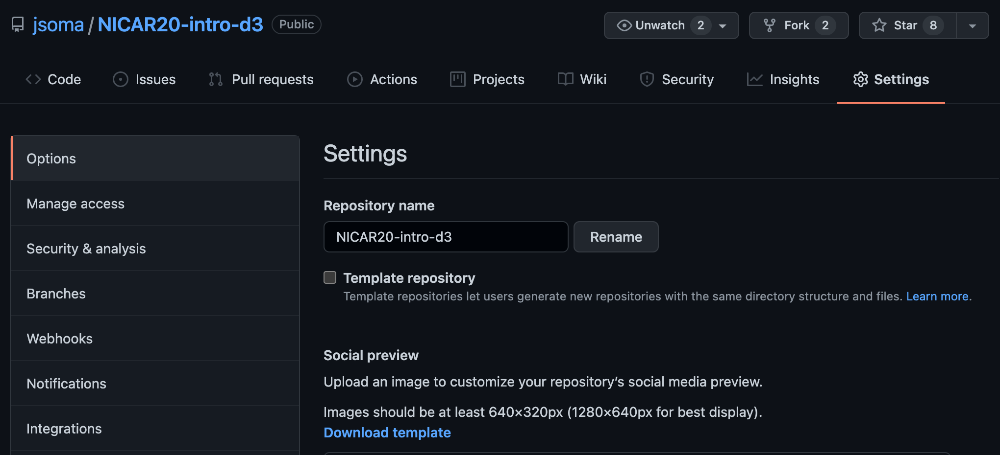

# Organizing your repositories

My golden rule of GitHub is **no one wants to read your code, they want to read _about_ your code**, and all of my suggestions are structured around that. Potential employers especially want to pop into your repo, get an idea of what's going on, and run right back out. No time to actually check out the code!

## What gets a repository?

Each repository is generally **the code for a single project**. A "single project" can mean pretty much anything! Some examples might be:

* The [analysis notebooks](https://github.com/BuzzFeedNews/2021-09-guardianship-filings) behind a story or series
* An [automatic scraper](https://github.com/datadesk/nws-wwa) and the data it downloads
* The code for [a package or library](https://github.com/jsoma/fuzzy_pandas)
* A unique, curated, or continually-updating [dataset](https://github.com/cmrivers/ebola)
* Your [notes for a workshop](https://github.com/jsoma/NICAR20-intro-d3) that you share with attendees
* A [long list of links](https://github.com/vinta/awesome-python) people might find interesting
* [Configuration files](https://github.com/sharkdp/config-files) that you use on new computers or want to share with others

The important thing is here is to not just throw everything you've ever worked on into a single repository! Some more specific examples:

Let's say you wrote a GitHub Actions auto-scraper to pull headlines from the NY Times, then analyzed how they adjust headlines after a story goes out. That would be **two separate repositories**. The auto-scraper is unique enough that it should get its own space to live (especially since it will continue to update!).

If you downloaded a list of New York City's trees from a website and write a story about it, that's **one repo**. While you probably cleaned the data a little bit, it isn't unique enough to get its own repo! If you had a website where people could submit data on trees and you pulled it into the database over time, however, that could quality for its own repo.

If you do sixteen different analyses of abandoned wells in Texas, it might be sixteen stories but I'd probably put it all of it in **a single repository**. That way someone who was interested in the topic wouldn't have to jump around so much! If they were all very difference in scope or presentation, though, splitting could also make sense.

### ...but what about homework?

Unless an instructor tells you otherwise, you should absolutely have your terrible, awful, I'm-still-learning-things homework up on GitHub.

You'll be embarrassed, you'll be ashamed, you'd rather be shot into the center of the sun, but remember: **no one wants to read your code, they just want to read _about_ it.** No employer is going to look at your homework and decide to not hire you based on what's inside. They'll ignore the code, see that the repo is well organized and well documented, and they'll be _impressed_.

*In all honesty: I **love** to look at peoples' homeworks on GitHub. But not to judge them! It's only so I can learn about the classwork they've taken and see what kind of exercises teachers give out. I'm exceptionally nosy about how things are taught.*

It's up to you whether you'd rather organize it as all of your homework in a single repository or separate it into multiple repos. If you choose to keep them in a single repo, be sure to pay attention to the [directory structure](#directory-structure) section – you'll probably want to organize them into one folder for each assignment.

## What goes in my repository?

It really depends on what your repository is _about_, but as a gentle suggestion I'll say:

* Your code
* A README explaining what's going on in the repo

That's just about it! **The most important part is the README**, which is the "front page" that shows up when someone visits your repo. Like I said before, no one wants to read your code, they only want to read _about_ your code.

If you did an incredible project and only posted a README without any code, people could still figure out what you did and reach out to you for more details. If you post your code and no README, people are going to slam that back button fast enough to bring their tiny little fingers. "What was that code all about?" they'll wonder to themselves. No one will ever know!

**Note for data-driven repositories:** if you're including an analysis, it's best practice to also include the data that is being analyzed. If the data is too big for GitHub – larger than 100MB – you'll want to provide a link to the data in the README and in your analysis code.

## Repository name

Your repository's name is going to be the first thing people see about it. Give it a name that makes sense.

If you need to change a repo's name, open it on GitHub and then go to **Settings > Options**. Changing the repository's name is right there at the top! You don't need to do anything else on your machine after you change it, it just _knows_.

## Directory structure

If you have more than a few files – maybe a couple PDFs of documentation, a handful of CSV files, some HTML and a couple Python scripts - _organize them into directories_. Organization is so important to developers there are [entire software packages built around organizing your work!](https://cookiecutter.readthedocs.io/en/1.7.2/)

For example, [this BuzzFeed News repository about federal equipment transfers to law enforcement](https://github.com/BuzzFeedNews/2020-06-leso-1033-transfers-since-ferguson) has `data`, `notebooks` and `outputs` folders.

## File names

Names should be **brief, clean, and descriptive.** It's not a good look if your files are named something like `analysis_FINAL_v2_(1).ipynb`! Rename it `Firearms Analysis.ipynb` and you'll be in a better place.

Also, be sure to **use the filename standards for the ecosystem you're working in**. For example, the reason why `Firearms Analysis.ipynb` has spaces and capital letters is because they're both accepted in Jupyter notebook filenames. If it was instead a plain Python file, `firearms_analysis.py` would be a better renaming candidate.

## Competing code bases

Early in your development career, you'll often end up creating two directories:

1. The place where you actually write your code
2. A separate directory for the repository, where you copy the clean, finished code

**Please stop doing that!** You're making your life more difficult than it should be. Trying to manage multiple copies of the same code never ends up well.

By having one true "source of knowledge" – keeping the "real" code in the repo – you'll never have your GitHub repo out of sync with the best, most recent version of your code. You'll never accidentally delete your updates by trashing the "wrong" directory, or lose months of work from a computer crash by forgetting to update the "finished" version.

**Just make the original folder the actual repository, problem solved.**

***But what about my `firearms_analysis_FINALfinal_v2_(1).ipynb`?** You don't need multiple versions of the file, that's what git is for! If you erase something you end up needing later, all you have to do is ask git to go back in time and you can find your old code.*

## No junk files!

Sometimes your computer creates files you **don't want included in your repo.** Temporary files, system files, all sorts of things that only act as clutter on the GitHub interface.

Sometimes you create files you don't want shared, either! Scratch files where you're taking notes, files with secret variables in them, all sorts of things.

Our next section addresses the solution: `.gitignore`