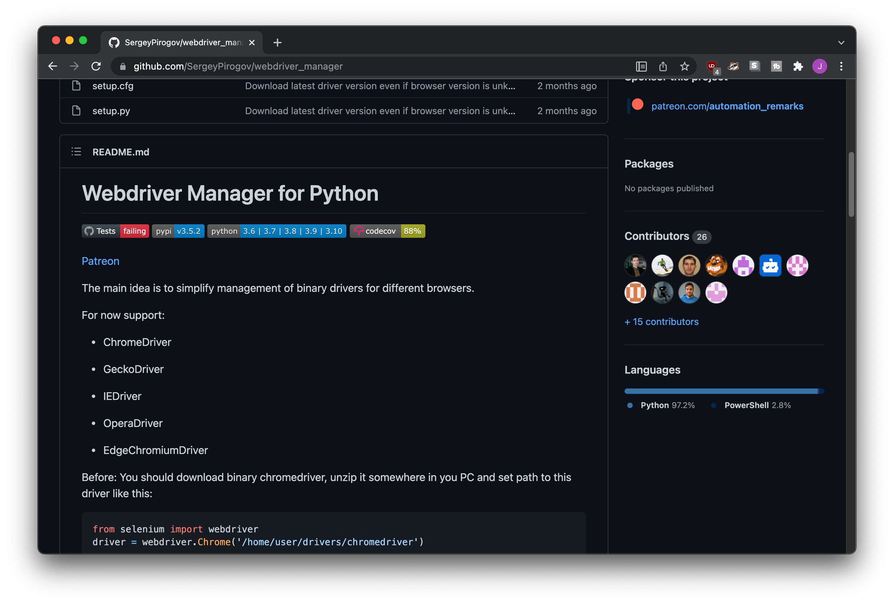
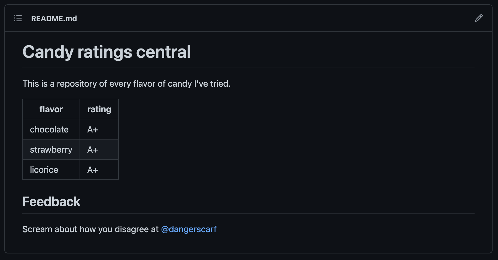
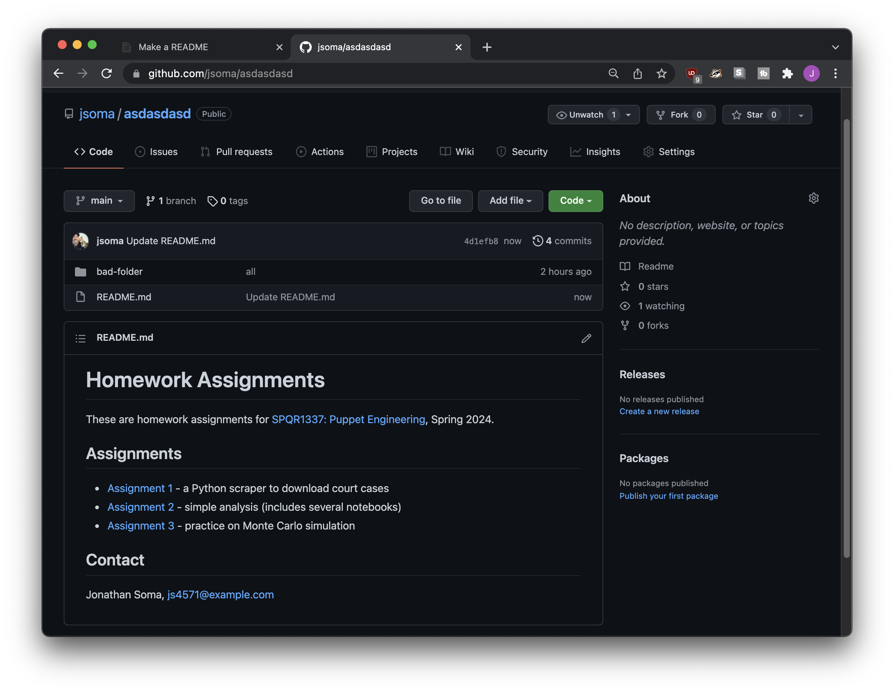

# README, your repo's front page

## What is a README?

When you visit a repository, the very first thing you see is a list of files. If there aren't many files or if you scroll down, though, you quickly see [a nice little homepage](https://github.com/SergeyPirogov/webdriver_manager):



This is the README, which you'll find in all sorts of repositories. README will often cover why a repo was created, what it contains, and how to use the content inside.

Since **no one wants to read your code, they want to read _about_ your code**, and keeping that in mind a solid README if the ticket to success.

## Creating a README

To create a README, you'll want to create a file called `README.md` in your repository. Not inside any folders - up at the top!

README files are generally written in a language called **Markdown**, which is why it has an `.md` extension. Unlike something like Word or Google Docs, Markdown can use plain text to express links, bold, etc.

For example, let's say I created a new `README.md` file with the following content:

```md
# Candy ratings central

This is a repository of every flavor of candy I've tried.

|flavor|rating|
|---|---|
|chocolate|A+|
|strawberry|A+|
|licorice|A+|

## Feedback

Scream about how you disagree at [@dangerscarf](http://twitter.com/dangerscarf)
```

When a visitor comes to my repository, they'll see it rendered all nicely:



Beautiful, right?

## README contents

It depends on the kind of project you're posting about, but in general a README might contain:

* The title of the project
* A short description of what the repository contains
* Links to useful information
* How someone might use the repository
    * Installation instructions or prerequisites (e.g. run `pip install beautifulsoup4 pandas`)
    * Usage instructions (e.g. run `python scrape.py`)
* The license your code is granted under (oh boy this needs another section. By default it's copyrighted to you, though, so don't worry yet.)

For example, if you had a single repository that contained several homework assignments, you might ignore most of the above and do something like this:

```md
# Homework Assignments

These are homework assignments for [SPQR1337: Puppet Engineering](https://www.youtube.com/channel/UCg3t2I9DIsU1HxNOHoPcLlw), Spring 2024.

## Assignments

* [Assignment 1](homework-01/scraper.py) - a Python scraper to download court cases
* [Assignment 2](homework-02/) - simple analysis (includes several notebooks)
* [Assignment 3](homework-03/horses.ipynb) - practice on Monte Carlo simulation

## Contact

Jonathan Soma, [js4571@example.com](mailto:js4571@example.com)
```

Which would display like the image below, linking to either individual files in the repo (Assignments 1 and 3) or directory listings (Assignment 2).



While it isn't the most detailed listing, it give a visitor enough information to understand what the class was about, what my homework assignments were, and gives them the option to click through to the areas they're interested in without 

## Writing Markdown

To write a solid README, you'll want to write it in Markdown. You can step through [a whole lesson here](https://commonmark.org/help/tutorial/) or just stick with [a nice quick reference](https://commonmark.org/help/) instead.